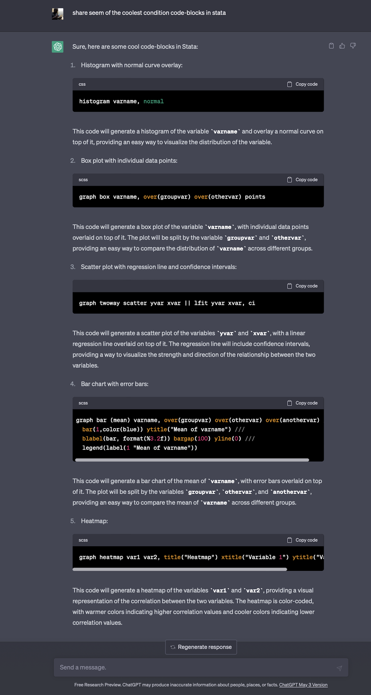
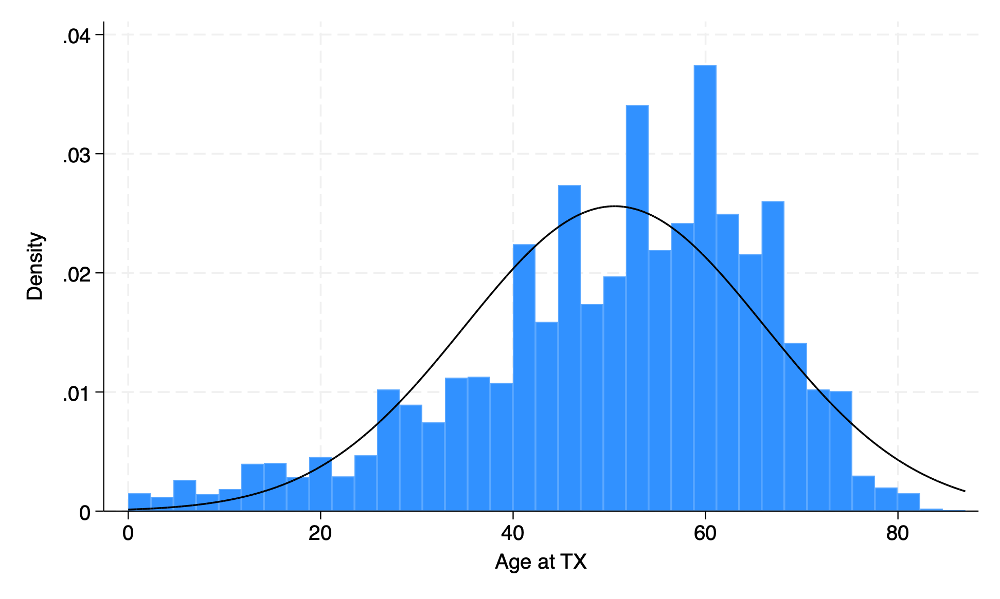
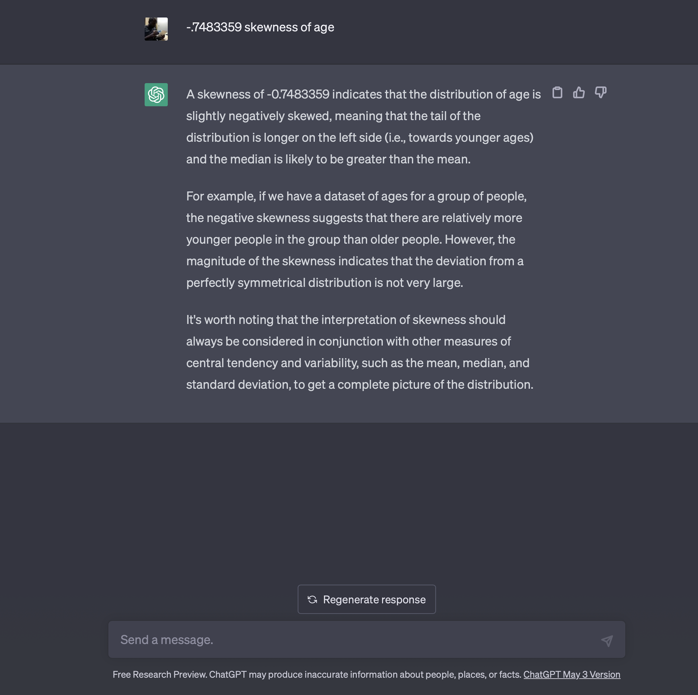
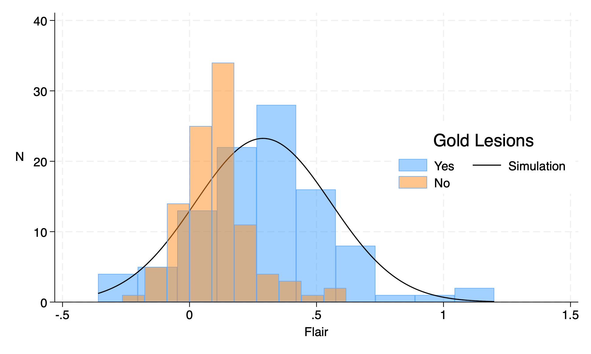
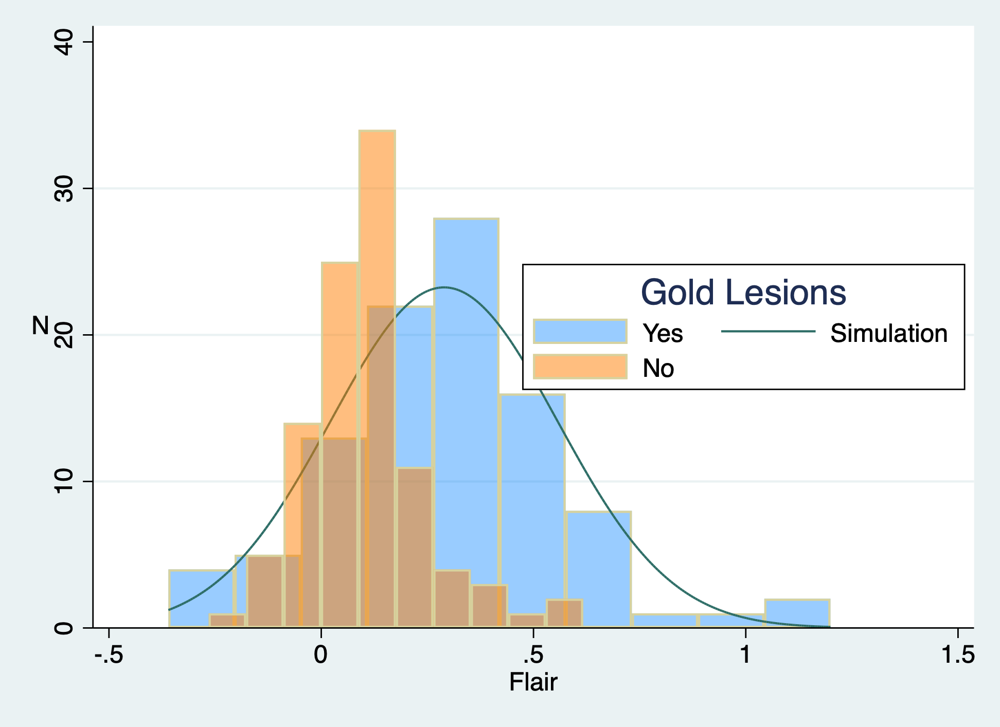

# if c(version)>16 {

## 8.1 codetta



## 8.2 stunning

```stata
use transplants, clear 
histogram varname, normal
graph export histnormal.png, replace 
```


```stata

. sum	age,d

		Age at	TX
					
	Percentiles	Smallest
1%	6	0
5%	20	0
10%	29	0		Obs	6,000
25%	41	0		Sum of wgt.	6,000

50%	53			Mean	50.56117
		Largest		Std. dev.	15.58661
75%	62	83
90%	68	83		Variance	242.9424
95%	71	83		Skewness	-.7483359
99%	77	87		Kurtosis	3.268634

```



## 8.3 transparency

```stata

qui {
	clear
	if _N {
		fcolor option is really neat
		when overlaying histograms
		one doesn't coverup the other
	}
	if c(N)==0 {
		global url1 https://raw.githubusercontent.com/bcaffo/
		global url2 ds4bme_intro/master/data/
		if c(version)>17 {
			di "you're good to go"
	    }
	    else {
		    set scheme stcolor
	    }
	}
	if _N<1 {
		import delimited "${url1}${url2}oasis.csv", clear
	}
	if _N {
		#delimit ;
		hist flair_10, 
		    legend(on
			    ti("Gold Lesions")
			    ring(0)
				pos(3)
				col(2)
				lab(1 "Yes")
				lab(2 "Simulation")
				lab(3 "No")
			)
			xti("Flair")
			yti("N",
			    orientation(horizontal)
			)
		    freq 
			normal 
			fcolor(midblue%40) 
			addplot(hist flair_20, 
			    freq 
				lpattern(solid) 
				fcolor(orange%50)
			)
		;
		graph export transparency.png, replace ;
		#delimit cr
	}
}
```



## 8.4 scheme

```stata
qui {
	clear
	if _N {
		fcolor option is really neat
		when overlaying histograms
		one doesn't coverup the other
	}
	if c(N)==0 {
		global url1 https://raw.githubusercontent.com/bcaffo/
		global url2 ds4bme_intro/master/data/
		if c(version)>17 {
			set scheme s2color
	    }
	    else {
		    noi di "you're good to go!"
	    }
	}
	if _N<1 {
		import delimited "${url1}${url2}oasis.csv", clear
	}
	if _N {
		#delimit ;
		hist flair_10, 
		    legend(on
			    ti("Gold Lesions")
			    ring(0)
				pos(3)
				col(2)
				lab(1 "Yes")
				lab(2 "Simulation")
				lab(3 "No")
			)
			xti("Flair")
			yti("N",
			    orientation(horizontal)
			)
		    freq 
			normal 
			fcolor(midblue%40) 
			addplot(hist flair_20, 
			    freq 
				lpattern(solid) 
				fcolor(orange%50)
			)
		;
		graph export transparency.png, replace ;
		#delimit cr
	}
}
```



## 8.5 punchline
```stata
if c(version)>17 { //tip 4 hw3
    set scheme s2color
}
else { //stcolor is default in v18
    di "you're good to go!"
}
```


