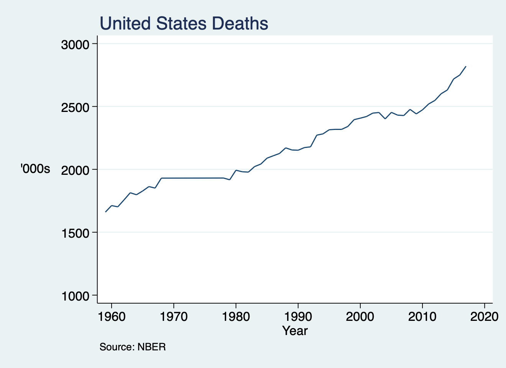
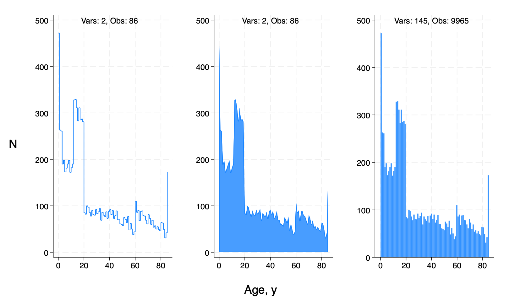
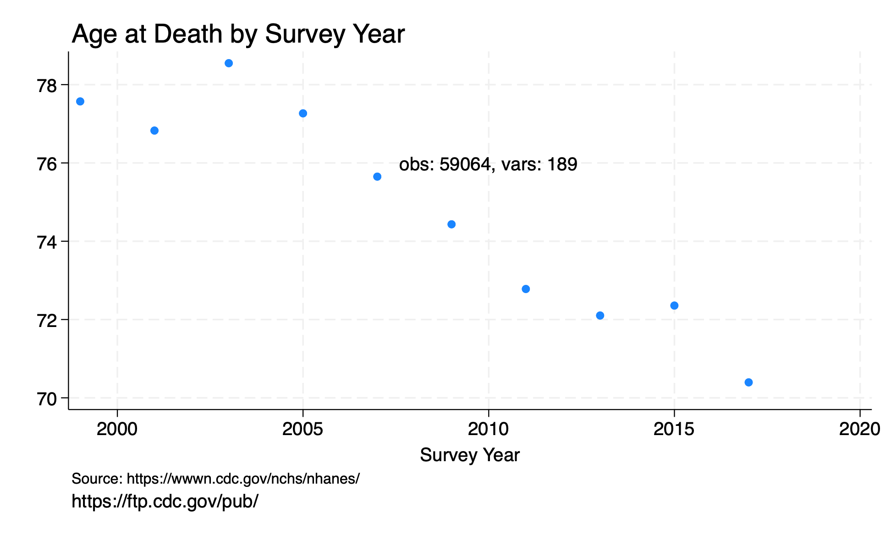
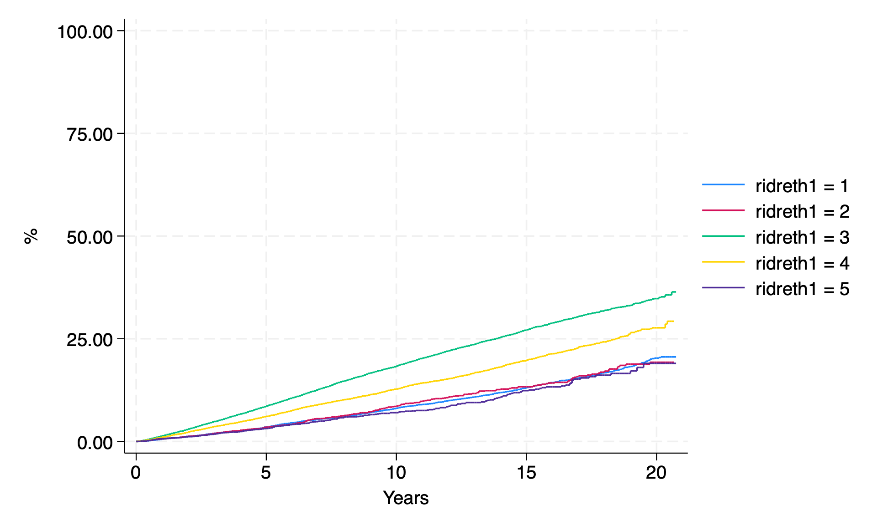

# twoway

[video](https://jhjhm.zoom.us/rec/share/LcwchujwTNi_2RJ2_LmwGxrjvUOVBaKRbS4ZKWGf1F5TWm-NO-IFIREzTCxVDpvN.xBe4l_9y6oHFKsam?startTime=1683228995000)

This is a `twoway` plot:



Databases:

* [cdc.gov](https://ftp.cdc.gov/pub/)
* [nber.org](https://data.nber.org/mortality/)

Workflow:

* [import](https://raw.githubusercontent.com/jhustata/book/main/nberv050223.do) .csv files -> save .dta files
* [logfile](https://raw.githubusercontent.com/jhustata/book/main/nberv050223.txt) to capture salient bits of process
* [dofile](https://raw.githubusercontent.com/jhustata/book/main/nberappend.do) that appends all the saved .dta files from step #1
* [logfile](https://raw.githubusercontent.com/jhustata/book/main/nberappend.log) that documents the above process
* [twowayplot](https://raw.githubusercontent.com/jhustata/book/main/nber.twoway.do) script that produces the above figure

Science:

* [open](https://www.jhsph.edu/departments/w-harry-feinstone-department-of-molecular-microbiology-and-immunology/academics-and-degree-programs/R3-PhD-program/r3-curriculum-overview) the entire process is published 
* [public](https://jupyterbook.org/en/stable/intro.html) in the 21st century this means online
* [github](https://en.wikipedia.org/wiki/GitHub) gh-pages can freely host your content
* reproducible the entire world has access to your .do files on github 
* [classbook](https://jhustata.github.io/book/intro.html) you guys have access to all the stuff that this classbook is made of
* et tu? on a scale of 0-10 how do you score on openness? who has access to your dofiles?

Credo:


Which of these is **not** a `twoway` graph? Does the `area` under the curve represent anything meaningful?

Crudely, the AUC might be viewed as rectangular: `height` is 100 individuals x `width` is 100 years (i.e., `ages`) = 10,000

Does 10,000 correspond to any of the output? Perhaps to `c(N)`?



Below's the script that produced them but you have to do some debugging before it works. There's no free lunch today!

I'd like to invoke the [metaphor](https://jhustata.github.io/book/_downloads/785b3e7ec96641cdff07100d6b7131b3/metaphor.png) of gene activation, which is analogous to `if macro {`, `else if macro {`, and `else {`. Although below we have Stata code-blocks rather than genetic code, the metaphor is apt. What happens `upstream` in one code-block may affect the expression of another `downstream` code-block for a given process, but in a dofile as compared to a given biological process.

You <u>**ought to**</u> emerge from this class thinking of Stata programming as a series of `if macro {` conditional statements. And your teaching team will lookout for these in your .do files!

```stata

qui {
 if c(N) { //clear data before running script
        1. adopted from wk1 of this class
  1. https://jhustata.github.io/book/bbb.html
  2. import demographics data from nhanes
 }
 if c(N)<1 { //settings,logfile,macros
  capture log close 
  log using session0.log, replace 
  global url https://wwwn.cdc.gov/Nchs/Nhanes/1999-2000/
  global datafile DEMO.XPT 
 }
 if c(N)<2 { //import datafile
  import sasxport5 "${url}${datafile}", clear
  replace ridageyr=.
  noi di "N=`c(N)'"
 }
 if c(N)>3 {
     g number=1
  preserve 
      sum ridageyr
   assert c(type) == "float"
      collapse (sum) number,by(ridageyr)
 }
 local N=c(N)-1
 if `N' { //no ouput if c(N)=0
  noi di "N=`c(N)'"
  local ages=c(N)
  line number ridageyr, connect(stairstep) /*
      */text(500 40 "Vars: `c(k)', Obs: `c(N)'") /*
   */yti("") /*
   */xti("")
  graph save agedist1.gph,replace 
  twoway area number ridageyr, connect(none) /*
      */text(500 40 "Vars: `c(k)', Obs: `c(N)'") /*
   */yti("") /*
   */xti("")
  graph save agedist2.gph,replace 
  restore 
 }
 if `N' {
  noi di "N=`c(N)'"
  hist ridageyr, freq bins(`ages') /*
      */text(500 40 "Vars: `c(k)', Obs: `c(N)'") /*
   */yti("") /*
   */xti("")
  graph save agedist3.gph,replace 
  graph combine agedist1.gph /*
              */agedist2.gph /*
     */agedist3.gph /*
         */, row(1) /*
      */  l1ti("N",orientation(horizontal)) /*
      */  b1ti("Age, y")
  graph export agedist.png,replace 
  noi di c(scheme)
  noi di c(version)
 }
 else {
  noi di "N=`N' (i.e., code-block is not expressed)"
 }
}


```

* Sampling large datasets
* Approach to workflow
* May cut hours off efforts

[here's](https://raw.githubusercontent.com/jhustata/book/main/mortalitysample.do) an example

* exploratory analyses on sample
* build .do file on sample, iterate
* submit final job to full dataset

Let's [recall](https://jhustata.github.io/book/aaa.html) an extra credit challenge from the first day of class:

```{seealso}
**Bonus points:** Use the tokenize command to append the DEMO.XPT files for all continuous NHANES: 1999-2018 into one file. Your .do file should include only one import sasxport5 statement. Search this book for the import sasxport5 command. Up to 1.5 bonus points
```

We now wish to link the dataset created above to mortality outcomes to perform survival analysis. See chapter 2: `r(mean)` and specifically the `if 6 {` code-block, which was exclusively dedicated to [survival analysis](https://jhustata.github.io/book/fff.html) and used the `stset`, `sts graph`, and `stcox` commands! How may we go about this using the online resources available to us[?](https://raw.githubusercontent.com/jhustata/book/main/nhanes_v0.do)

```stata
if 0 {
    this is not a .do file for you to copy & paste
    instead, run the commands sequentially
    one-by-one, except, of course, the twoway command
    as well as the sts graph command. you'll need to 
    copy & paste that long line of code into a dofile and do   
}

nhanes_mortality //install programs: click on "?" that ends the last paragraph
nhanes_continuous_demo 
merge 1:1 seq using nhanes_mortality, keep(matched)
tab survey
lookfor age
lookfor follow
egen surveytag=tag(survey)
codebook surveytag
desc survey 
split survey, parse("-")
destring survey1, replace 
g years=permth_exm/12
lookfor mort 
g age_at_death=ridageyr + years if mortstat==1
bys survey: egen av_age_at_death=mean(age_at_death)
#delimit ;
twoway scatter av_age_at_death survey1 if surveytag,
     ti("Age at Death by Survey Year", pos(11))
  yti("")
  xti("Survey Year")
  note("Source: https://wwwn.cdc.gov/nchs/nhanes/")
  caption("https://ftp.cdc.gov/pub/")
  text(76 2010 "obs: `c(N)', vars: `c(k)'");
graph export twoway_ageatdeath.png, replace ;
stset years, fail(mortstat);
sts graph, 
    by(ridreth1 )
    fail
 per(100)
 ti("")
 yti("%") 
 xti("Years");
graph export km_race.png, replace ;
stcox i.ridreth1 ;
stcox i.ridreth1  ridageyr riagendr ;
#delimit cr

```

Let's study this output and discuss a few issues:

* `egen` command
* `by` command
* `c(N)`, `c(k)` macros embedded in graph
* improving the aesthetics

Which of these is a twoway graph?





Then, in the second-half of the class we'll recap .dofile structure in context of the `hw1.lastname.firstname.do` solution we'll share with you. Let's first briefly study an .ado file that you can find on your computers here:

```stata

 ~/applications/stata/ado/base/s/stcox.ado

```

This is the native Stata program for the `stcox` command used in Cox proportional hazards regression. We are **not** presently interested in the content of the .do file but merely wish to use it as an exemplar for our scripts and programs, including our `ideal` hw1 solution. We are presently interested in `.do` file or `.ado` file structure. Don't be intimidated by the length of the script. Just look out for salient features:

1. lines of code rarely `cross the line` (Stata's suggested right margin)
2. coder uses more than one method for line continuation including

```stata

//entirely new to me as of this week
sts graph, /*
    */ by(race)

//by far the most popular approach
sts graph, ///
       by(race)

//more efficient the longer the line of code
#delimit ;
sts graph, 
       by(race)
#delimit cr
```
3. never uses `#delimit ;` (this is my personal fave, especially for a very long line of code)
4. otherwise, the entire script is a bunch of `if`, `elseif`, `else` code-blocks
5. up to this point we've used integers like `if 1 {` to define a code-block
6. hence-forth we'll get a litte fancier and replace the integers with system-define macros: `c()`, `e()`, `r()`; watch today's [video](https://jhjhm.zoom.us/rec/component-page?action=viewdetailpage&sharelevel=meeting&useWhichPasswd=meeting&clusterId=aw1&componentName=need-password&meetingId=Z3kGX04VGRn2KAUFbSOWgVe-o4n-GgGfDtzuyPU_oA3Hp3HZ2_vPkyyvt4n7Pzre.8L9JnGGqb6K8tsXK&originRequestUrl=https%3A%2F%2Fjhjhm.zoom.us%2Frec%2Fshare%2FLcwchujwTNi_2RJ2_LmwGxrjvUOVBaKRbS4ZKWGf1F5TWm-NO-IFIREzTCxVDpvN.xBe4l_9y6oHFKsam%3FstartTime%3D1683228995000) on `if c(os)=="MS Office" {`
7. and maybe occassionally with programmer-defined macros: `N` in the above script
8. the limit is your imagination
9. but i hope you appreciate the flexibility conditional code-blocks bring to programming!
10. we have been hard-coding the values of `if 0 {`, `if 1 {`, etc as we build .do file structure. code-blocks have thus far been placeholders, elements required by **syntactic** constraints imposed on you by your instructor but that carry little or no **semantic** information.

But the `hw1` script of one of your classmates has serendipitously segued us to informative, functional conditional `if` statements:

[de-identified](https://raw.githubusercontent.com/jhustata/book/main/placeholders1.do) `hw1` script

[edited](https://raw.githubusercontent.com/jhustata/book/main/placeholders2.do) `hw` script

Copy & paste first the original and then the edited versions into your .do file editor and run. Of course you'll need to have `hw1.txt` in the appropriate `pwd`.

Remember:

```stata

//c() class system-defined macros
h creturn
di c(os)
assert c(os)=="MacOSX"
assert c(os)=="MS Office"
assert c(os)=="Linux"
```

This brings us to our first substantive discussion of conditional statements about code-blocks:

```stata

if c(os) == "MS Office" {
    filepath\filename.extension
}
else {
    filepath/filename.extension
}
```

```stata

*! version 7.7.7  06mar2023
program stcox, eclass byable(onecall) sort ///
  prop(st swml nohr hr svyb svyj svylb mi)
 version 8, missing
 local version : di "version " string(_caller()) ", missing:"
 if replay() {                  /* Branch off to stcox_fr as needed */
  syntax [, ESTImate *]
  if "`estimate'" == "" {
   if _by() { 
    error 190
   }
   if `"`e(cmd2)'"' != "stcox" {
    error 301
   }
   if "`e(shared)'" != "" {
    stcox_fr `0'
    exit 
   }
  }
 }
 if _by() {
  local by "by `_byvars'`_byrc0':"
 }
 syntax [varlist(default=none fv)] [if] [in] [, /*
  */ FRailty(string) SHared(string) ESTImate *]
 local fvops = "`s(fvops)'" == "true" | _caller() >= 11
        if `fvops' {
                local version: di "version " ///
  string(max(11,_caller())) ", missing:"
        }

 if `"`shared'"' != "" | `"`frailty'"' != "" {
  `version' `by' stcox_fr `0'
  ereturn local cmdline `"stcox `0'"' 
  exit 
 }
 `version' `BY' _vce_parserun stcox, stdata noneedvarlist ///
  mark(STrata SHared OFFset tvc CLuster)   ///
  numdepvars(0) : `0'
 if "`s(exit)'" != "" {
  ereturn local cmdline `"stcox `0'"'
  exit
 }
 `version' ///
 `by' stcox_7 `0'
 if (!replay() | "`estimate'" != "") {
  ereturn local cmdline `"stcox `0'"'
 }
 exit 
end

program define stcox_7, eclass byable(recall)
 local version : di "version " string(_caller()) ", missing:"
 version 7, missing

 if _caller()<6 {
  if _by() { error 190 } 
  ztcox_5 `0'
  exit
 }

 if replay() {
  syntax [, ESTImate noHR * ]
  if `"`estimate'"'=="" {
   if _by() { error 190 }
   if `"`e(cmd2)'"' != "stcox" {
    error 301 
   }
   if "`e(prefix)'" == "svy" {
    _prefix_display, `hr' `options'
    exit
   }
   _get_diopts diopts, `options'
   local hr = cond(`"`hr'"'=="", "hr", "")

   local h = cond(`"`e(strata)'"'=="", /*
    */ "Cox regression", /*
    */ "Stratified Cox regression")


   local h1="no ties"
   if "`e(ties)'"=="breslow" {
    local h1="Breslow method for ties" 
   }
   else if "`e(ties)'"=="efron" { 
    local h1="Efron method for ties"
   }
   else if "`e(ties)'"=="partial" { 
    local h1="exact partial likelihood method for ties"
   }
   else if "`e(ties)'"=="marginal" { 
    local h1="exact marginal likelihood method for ties" 
   }

   di _n as txt `"`h' with `h1'"'
   st_hcd
   di
   local offset `e(offset)'
   est local offset
   _coef_table, `hr' `options'
   est local offset `offset'
   `version' stcox_footnote
   if `"`e(converged)'"' == "0" {
    di as txt "Warning: Convergence not achieved."
   }
   exit
  }
 }
 st_is 2 analysis

 local oldbaseh = cond(_caller()<7,"BASEHazard(string)","")

 if _caller() < 14 {
  local TVCOPT TVC(varlist)
 }
 else {
  local TVCOPT TVC(varlist fv)
 }

 syntax [varlist(default=none fv)] [if] [in] [,CLuster(passthru) /*
 */ CMD ESTImate noHR Level(cilevel) Robust noSHow NOLOG LOG/*
 */ BREslow EFRon EXACTM EXACTP `oldbaseh' /*
 */ BASEHC(passthru) BASEChazard(passthru) BASESurv(passthru) /*
 */ MGale(passthru) esr(passthru) /*
 */ SCHoenfeld(passthru) SCAledsch(passthru) `TVCOPT' /*
 */ texp(string) altvce(name) VCE(passthru) * ]

 // NOTE: altvce() is an undocumented option set by _vce_parserun for
 // the purpose of generating an improved error message when this
 // command is called with an option that generates a variable along
 // with an alternative <vcetype> that resamples the data.

 local fvops = "`s(fvops)'" == "true" | _caller() >= 11
        if `fvops' {
                local version: di "version "string(max(11,_caller())) ", missing:"
        }

 _parse_iterlog, `nolog' `log'
 if "`s(nolog)'" == "nolog" {
  local log nolog
 }
 else if "`s(log)'" == "log" {
  local log log
 }

 _get_diopts diopts options, `options'
 _vce_parse, argopt(CLuster) opt(OIM Robust) old  ///
  : [`weight'`exp'], `vce' `robust' `cluster'
 local cluster `r(cluster)'
 local robust `r(robust)'
 local vce = cond("`r(vce)'" != "", "`r(vce)'", "oim")

 if `"`basehazard'"' != "" {
  if `"`basehc'"' != "" { 
   di as err /*
 */ "options {bf:basehazard()} and {bf:basehc()} may not be specified together"
   exit 198 
  }
  local basehc `"basehc(`basehazard')"'
 }
 if _by() {
  _byoptnotallowed basehc()      `"`basehc'"'
  _byoptnotallowed basechazard() `"`basechazard'"'
  _byoptnotallowed basesurv()    `"`basesurv'"'
  _byoptnotallowed mgale()       `"`mgale'"'
  _byoptnotallowed esr()         `"`esr'"'
  _byoptnotallowed schoenfeld()  `"`schoenfeld'"'
  _byoptnotallowed scaledsch()   `"`scaledsch'"'
 }

 if "`altvce'" != "" {
  _prefix_vcenotallowed "`altvce'" basehc()      `"`basehc'"'
  _prefix_vcenotallowed "`altvce'" basechazard() `"`basechazard'"'
  _prefix_vcenotallowed "`altvce'" basesurv()    `"`basesurv'"'
  _prefix_vcenotallowed "`altvce'" mgale()       `"`mgale'"'
  _prefix_vcenotallowed "`altvce'" esr()         `"`esr'"'
  _prefix_vcenotallowed "`altvce'" schoenfeld()  `"`schoenfeld'"'
  _prefix_vcenotallowed "`altvce'" scaledsch()   `"`scaledsch'"'
 }

 if "`tvc'" != "" {
  _tvc_notallowed basechazard() `"`basechazard'"'
  _tvc_notallowed basehc() `"`basehc'"'
  _tvc_notallowed basesurv() `"`basesurv'"'
  _tvc_notallowed esr()  `"`esr'"'
  _tvc_notallowed mgale()  `"`mgale'"'
  _tvc_notallowed scaledsch() `"`scaledsch'"'
  _tvc_notallowed schoenfeld() `"`schoenfeld'"'
 }

 local passthru `basehc' `basechazard' `basesurv' `mgale' /*
  */ `esr' `schoenfeld' `scaledsch'

 local id : char _dta[st_id]
 local w  : char _dta[st_w]
 local wt : char _dta[st_wt]
 local t0 `"t0(_t0)"'
 local d `"dead(_d)"'

 tempvar touse 
 st_smpl `touse' `"`if'"' `"`in'"' `"`cluster'"'
 markout `touse' `varlist'
 if _by() {
  qui replace `touse'=0 if `_byindex'!=_byindex()
 }

 if `"`wt'"'=="pweight" {
  local robust `"robust"'
 }
 if `"`robust'"'!="" & `"`cluster'"'=="" & `"`id'"'!="" {
  local cluster `"`id'"'
 }
 if `"`cluster'"'!="" {
  local cluster `"cluster(`cluster')"'
 }

 st_show `show'

 if `"`texp'"' != "" & "`tvc'" == "" {
  di as err "option {bf:texp()} requires option {bf:tvc()}"
                exit 198
        }

 local fvtvc 0
 if `"`tvc'"'!="" & _caller() < 14 {
  tempvar foft1
  if `"`texp'"' == "" {
   local texp _t
  }
  local texp: subinstr local texp " " "", all
  cap gen double `foft1' = `texp' if `touse'
  if _rc {
   di as err "{p 0 0 2}option {bf:texp()} invalid{p_end}"
   exit 198
  }
  qui count if `touse' & missing(`foft1')
  if `r(N)' {
                        di as err "{p 0 0 2}option {bf:texp()} evaluates to missing for "
                        di as err "`r(N)' observations{p_end}"
   exit 459
  }
  FunctionOfTime `foft1' if `touse'

  // tvc() has a limit of 100 variables
  local tvcvars : word count `tvc'
  if `tvcvars' > 100 {
   di as err "option {bf:tvc()} may not contain more than 100 variables"
   exit 198 
  }
  di
  version 11: _rmcoll `tvc', forcedrop
  local tvcvars `r(varlist)'
  local tvc `"tvc(`tvcvars')"'
  local texp `"texp(`texp')"'
  local noblank "noblank"
 }
 else if `"`tvc'"'!="" {
  tempvar foft1
  if `"`texp'"' == "" {
   local texp _t
  }
  local texp: subinstr local texp " " "", all
  cap gen double `foft1' = `texp' if `touse'
  if _rc {
   di as err "{p 0 0 2}option {bf:texp()} invalid{p_end}"
   exit 198
  }
  qui count if `touse' & missing(`foft1')
  if `r(N)' {
                        di as err "{p 0 0 2}option {bf:texp()} evaluates to missing for "
                        di as err "`r(N)' observations{p_end}"
   exit 459
  }
  FunctionOfTime `foft1' if `touse'

  // tvc() has a limit of 100 variables
  fvexpand `tvc' if `touse'
  local tvc `r(varlist)'
  local tvcvars : word count `tvc'
  if `tvcvars' > 100 {
   di as err "option {bf:tvc()} may not contain more than 100 variable"
   exit 198 
  }
  di
  version 14: _rmcoll `tvc', expand
  local tvcvars `r(varlist)'
  fvrevar `tvcvars'
  local ttvcvars `r(varlist)'
  if !`: list tvcvars == ttvcvars' {
   local fvtvc 1
  }
  local tvc `"tvc(`ttvcvars')"'
  local texp `"texp(`texp')"'
  local noblank "noblank"
 }
 if `"`cmd'"'!="" {
  di _n as txt `"-> cox _t `varlist' `w' `if' `in',"' _c
   di as txt `" `robust' `cluster' `t0' `hr' `d' `tvc' `texp'"' _c
  di as txt `" `options'"' _c
  di as txt `" `breslow' `efron' `exactm' `exactp' `passthru'"'
  exit
 }

 `version' ///
 cox _t `varlist' `w' if `touse', `robust' `cluster' /*
 */ `t0' `d' `tvc' `texp' /*
 */ `options' nocoef `breslow' `efron' `exactm' `exactp' /*
 */ `passthru' `noblank' `log'

 if `fvtvc' {
  tempname b
  matrix `b' = e(b)
  local stripe : colna `b'
  local ntvc : list sizeof ttvcvars
  local TVCVARS : copy local tvcvars
  forval i = 1/`ntvc' {
   gettoken tvar ttvcvars : ttvcvars 
   gettoken xvar TVCVARS : TVCVARS 
   if "`tvar'" != "`xvar'" {
    local stripe : subinstr local stripe ///
     "`tvar'" "`xvar'", word all
   }
  }
  version 14: matrix colna `b' = `stripe'
  est repost b=`b', rename buildfvinfo ADDCONS
 }
 else {
  est repost, buildfvinfo ADDCONS
 }
 local chi2type "`e(chi2type)'"

 if e(N)==0 | e(N)>=. { exit 2001 }
 /* inherits e() stuff from -cox- */

 SaveOpt, `passthru'

 _post_vce_rank, checksize
 if "`chi2type'"=="Wald" {
  WaldTest
 }
 else {
  local df_m = cond("`e(rank)'"!="","`e(rank)'","0")
  est scalar df_m = `df_m'
  est local chi2type "LR"
 }

 global S_E_ll = e(ll)   /* double save */
 global S_E_chi2 = e(chi2)  /* double save */
 global S_E_mdf = e(df_m)  /* double save */


 st_hc `touse'

 if "`robust'" != "" {
  est local vce robust
 }
 est local vce "`vce'"
 est local estat_cmd stcox_estat
 est local predict stcox_p
 est local footnote stcox_footnote
 _ms_eq_info
 est hidden local k_eform = r(k_eq)
 est hidden local marginsprop addcons allcons
 est hidden local marginsfootnote _multirecordcheck
 est local marginsnotok CSNell  ///
    DEViance ///
    DFBeta  ///
    ESR  ///
    LDisplace ///
    LMax  ///
    MGale  ///
    SCAledsch ///
    SCHoenfeld ///
    SCores
 est local cmd2 "stcox"
 local offset `e(offset)'
 est hidden local offset1 `offset'
 est local offset `offset'
 global S_E_cmd2 "stcox"  /* double save */
 tempname b
 mat `b' = e(b)
 _ms_omit_info `b'
 local cols = colsof(`b')
 if `r(k_omit)' {
  if `r(k_omit)' == `cols' {
    local varlist ""
  }
  else {
    mata : ///
    st_local("varlist",invtokens(select(st_matrixcolstripe ///
    ("`b'")[.,2]',1:-st_matrix("r(omit)")))) 
  }
 }
 else {
  local varlist `varlist' `tvcvars'
 }
 unopvarlist `varlist'
 local varlist `r(varlist)'
 signestimationsample _t _t0 _d `varlist' `e(clustvar)' ///
           `e(offset)' `e(strata)'
 `version' ///
 stcox, `hr' level(`level') `diopts'
end


program define SaveOpt, eclass
 syntax [, MGale(string) BASEHC(string) BASEChazard(string) /*
  */ BASESurv(string) SCHoenfeld(string) /*
  */ SCAledsch(string) ESR(string) * ]
 est local mgale "`mgale'"
 est local basehc "`basehc'"
 est local baseh "`basedchazard'"
 est local basech "`basechazard'"
 est local bases "`basesurv'"

 SaveNm vl_sch "`schoenfeld'" "Schoenfeld"
 SaveNm vl_ssc "`scaledsch'" "scaled Schoenfeld"
 SaveNm vl_esr "`esr'"   "efficient score"

 if "`mgale'"      != "" { label var `mgale' "martingale" }
 if "`basehc'"!= "" { 
   label var `basehc' "baseline hazard contribution"
 }
 if "`basesurv'"   != "" { label var `basesurv' "baseline survivor function" }
 if "`basechazard'"!= "" { 
  label var `basechazard' "cumulative baseline hazard" 
 }
end

program define SaveNm, eclass
 args name base lname 

 if "`base'" == "" { exit }

 tempname b
 mat `b' = get(_b)
 local p = colsof(`b')
 local names : colnames(`b')

 local j = index("`base'","*")
 if `j' {
  local base = bsubstr("`base'",1,`j'-1)
  local i 1
  while `i' <= `p' {
   local iname : word `i' of `names'
   label var `base'`i' "`lname' - `iname'"
   local list `list' `base'`i'
   local i = `i'+1
  }
 }
 else {
  tokenize `base'
  local i 1
  while `i' <= `p' {
   local iname : word `i' of `names'
   label var ``i'' "`lname' - `iname'"
   local list `list' ``i''
   local i = `i'+1
  }
 }
 est local `name' `list'
end

program WaldTest, eclass

 est local chi2type Wald

 tempname b
 mat `b' = e(b)
 local names : colnames `b' 
 capture test `names'

 if !_rc {
  est scalar chi2 = r(chi2)
  est scalar df_m = r(df)
 }
 else {
  est scalar chi2 = 0
  est scalar df_m = 0
 }
end

program FunctionOfTime, sortpreserve
 syntax varname [if]

 marksample touse
 tempvar gr
 qui egen long `gr' = group(_t `touse')
 sort `gr'
 cap by `gr': assert `varlist' == `varlist'[1] if `touse'
 if _rc {
  di as err "{p 0 0 2}option {bf:texp()} is not a proper function of time "
  di as err "{p_end}"
  exit 459
 }
end

exit

```
